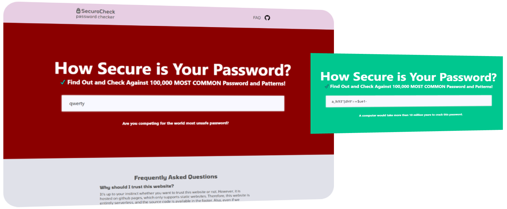

# SecuroCheck
 SecuroCheck is a password strength check utility based on web technologies.

  

## Features

- **A variety of features:**
- **Color-feedback:** Based on password strength, which is calculated using character categories
- **Cracking time estimation:** Estimates how long it would take a modern GPU to crack the password using brute force.
- **Character category detection:** Identifies the use of different character types, which strengthens passwords.
- **Weak pattern detection:** Detects weak patterns, like sequences and repeated characters.
- **Common password detection:** Compare against commonly used passwords using a pre-compiled list of 10 million passwords.
- **Unicode:** Accounts and handles for non-ASCII Unicode characters, like math symbols and emojis.

## How it functions

**Strength Estimation:** via brute-force, which is trying out all possible combinations of characters possible until the right password is found. The code calculates the entropy of the password, using the formula entropy = password length x log2(strength) and time to crack = strength ^ password length / guesses per second. Character property detection is implemented, checking if the password includes numbers, lowercase, whitespace, Unicode characters etc.

## Usage

- **GitHub Pages: https://stasyanski.github.io/SecuroCheck/**

## Important!

- **Performance:** The password strength calculation and cracking time estimation uses a modern GPU's brute force speed, 100 trillion guesses per second. This however, is quite subjective.
- **Common password list:** https://raw.githubusercontent.com/danielmiessler/SecLists/refs/heads/master/Passwords/Common-Credentials/10-million-password-list-top-100000.txt

## Contributing and feedback

Contributions are always welcome! We would love for others to contribute to this project, and it's improvement.

Feedback is also extremely valuable. We are open to any feedback you have.

- To contribute or provide feedback, contact us at [will provide a method soon]

## License

The MIT License lets you do almost anything you want with this project, even making and distributing closed source versions.

